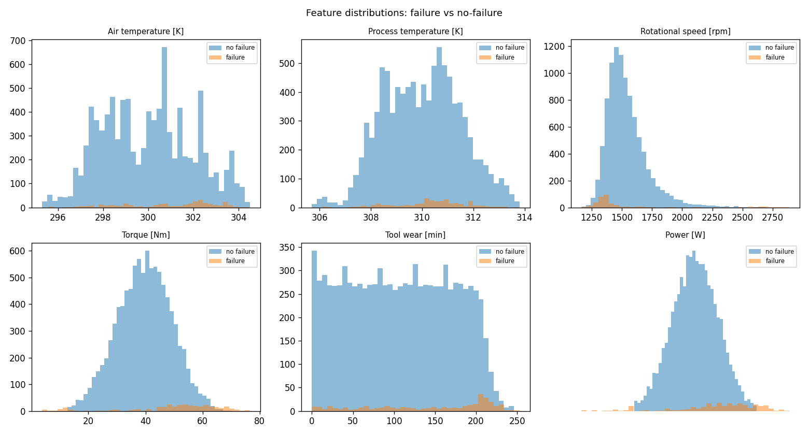

# AI4I 2020 — Exploratory Data Analysis Report
- Source: `ai4i2020.csv`
## 1. Integrity
- Rows: **10,000** | Columns: **14**
- Missing values: **0** | Duplicated rows: **0**
- Machine failure: **339 / 10,000** (rate **3.39%**, imbalance ≈ 1 : 28)
### Failure-mode counts
| Mode | Count | Description |
|---|---|---|
| TWF | 46 | Tool wear failure |
| HDF | 115 | Heat dissipation failure |
| PWF | 95 | Power failure |
| OSF | 98 | Overstrain failure |
| RNF | 19 | Random failure |

- Rows with >1 active mode: **24** (sum of modes 373 > failure count 339)
- Product type counts: {'L': 6000, 'M': 2997, 'H': 1003}

## 2. Numeric feature summary
|       |   Air temperature [K] |   Process temperature [K] |   Rotational speed [rpm] |   Torque [Nm] |   Tool wear [min] |   Power [W] |   Temp diff [K] |   Overstrain [min*Nm] |
|:------|----------------------:|--------------------------:|-------------------------:|--------------:|------------------:|------------:|----------------:|----------------------:|
| count |               10000   |                  10000    |                 10000    |      10000    |          10000    |    10000    |         10000   |              10000    |
| mean  |                 300   |                    310.01 |                  1538.78 |         39.99 |            107.95 |     6279.74 |            10   |               4314.66 |
| std   |                   2   |                      1.48 |                   179.28 |          9.97 |             63.65 |     1067.42 |             1   |               2826.57 |
| min   |                 295.3 |                    305.7  |                  1168    |          3.8  |              0    |     1148.44 |             7.6 |                  0    |
| 25%   |                 298.3 |                    308.8  |                  1423    |         33.2  |             53    |     5561.18 |             9.3 |               1963.65 |
| 50%   |                 300.1 |                    310.1  |                  1503    |         40.1  |            108    |     6271.03 |             9.8 |               4012.95 |
| 75%   |                 301.5 |                    311.1  |                  1612    |         46.8  |            162    |     7003    |            11   |               6279    |
| max   |                 304.5 |                    313.8  |                  2886    |         76.6  |            253    |    10469.9  |            12.1 |              16497    |

## 3. Correlation with `Machine failure`
| Feature | r(failure) |
|---|---|
| Torque [Nm] | 0.191 |
| Overstrain [min*Nm] | 0.190 |
| Power [W] | 0.176 |
| Temp diff [K] | -0.112 |
| Tool wear [min] | 0.105 |
| Air temperature [K] | 0.083 |
| Rotational speed [rpm] | -0.044 |
| Type code | -0.037 |
| Process temperature [K] | 0.036 |

## 4. Physics-rule re-derivation (encoding validation)
Re-derived TWF/HDF/PWF/OSF purely from variables, compared to labels:

| Mode | n_true | TP | FP | FN | Precision | Recall |
|---|---|---|---|---|---|---|
| TWF | 46 | 2 | 12 | 44 | 0.1429 | 0.0435 |
| HDF | 115 | 115 | 0 | 0 | 1.0 | 1.0 |
| PWF | 95 | 95 | 0 | 0 | 1.0 | 1.0 |
| OSF | 98 | 98 | 0 | 0 | 1.0 | 1.0 |

- TWF replacement band [200,240): 790 rows, 43 labelled TWF (probabilistic in source — encoded as *candidate*).
- RNF is random by construction and excluded from rule derivation.

## 5. Stratified 315-sample selection
- Seed: **42** | Size: **315**
- Sample failure rate: **3.49%** (population 3.39%)
- Sample mode counts: {'TWF': 2, 'HDF': 4, 'PWF': 1, 'OSF': 4, 'RNF': 3}
- Sample single-readable-label distribution:

| Label | Count |
|---|---|
| No failure | 301 |
| OSF | 4 |
| HDF | 4 |
| RNF | 3 |
| TWF | 2 |
| PWF | 1 |
